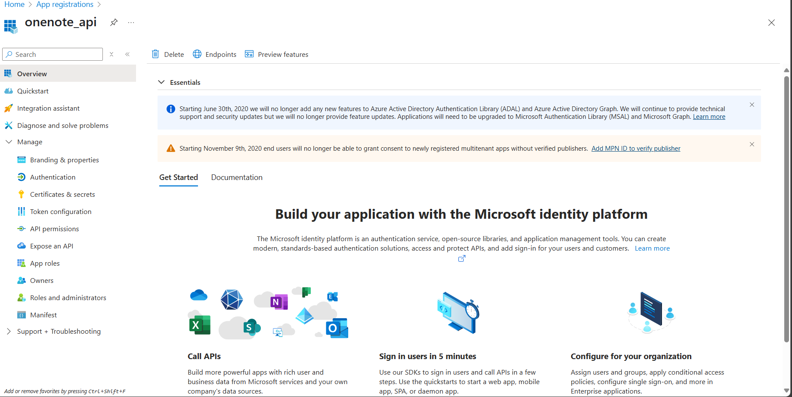

# OneNote API Utils

透過MS graph和Azure registered app來fetch OneNote筆記本資料

## Azure App Registration
到MS Azure App Registration註冊一個APP
> 目前測試是用免費版的MS帳號也可以註冊

### 設定Authentication
設定Platform
1. 選擇 Mobile and desktop applications
2. 勾選`https://login.microsoftonline.com/common/oauth2/nativeclient`

允許public client flows
> 這個不打開請求token時會有error

### 設定API Permission
至少要勾選MS Graph的`User.Read`和`Notes.Read`，才可以登陸拿token然後讀取Onenote筆記本資料

## 環境變數設定
在執行範例程式前，請設定下列環境變數：

* `ONENOTE_CLIENT_ID`：Azure App Registration 取得的 Application (client) ID
* `ONENOTE_NOTEBOOK_ID`：欲讀取的筆記本 ID
* `ONENOTE_TENANT_ID`：Tenant ID，選填，預設使用 common

## Usage
1. 執行`node ./src/tests/listNotebooks.js`列出筆記本
2. 找出欲讀取筆記本的ID後，設定至`ONENOTE_NOTEBOOK_ID`環境變數
3. 執行`node ./src/tests/fetchNotebook.js`讀取筆記本內容，並將對應的章節內容儲存至`./notebook_data/`中

## 主要差異摘要

以下表格簡要比較目前版本（第一版，HEAD）與先前版本（第二版，origin/main）的差異：

| 項目 | 第一版 (HEAD) | 第二版 (origin/main) |
| --- | --- | --- |
| Token 儲存與刷新邏輯 | 有完整實作，支援 token 過期自動更新 | 無 token 更新邏輯，只使用初次取得的 access token |
| Scopes | 包含 `offline_access` | 缺少 `offline_access` |
| `graphClient` `authProvider` | 使用 async 函式並支援自動 refresh | 使用一次性 `accessToken` |
| 頁面讀取邏輯 (`getPages`) | 加入分頁查詢邏輯 (`$top`, `$skip`) 且限制 `pageSize` | 單次請求全部頁面 |
| 結構與維護性 | 更模組化，支援 token 再利用 | 較簡單，但缺乏完整的使用者登入週期處理 |
| 可用性與擴充性 | 更符合實際應用需求，支援長期 session 使用 | 適合單次存取需求，較為簡化 |
